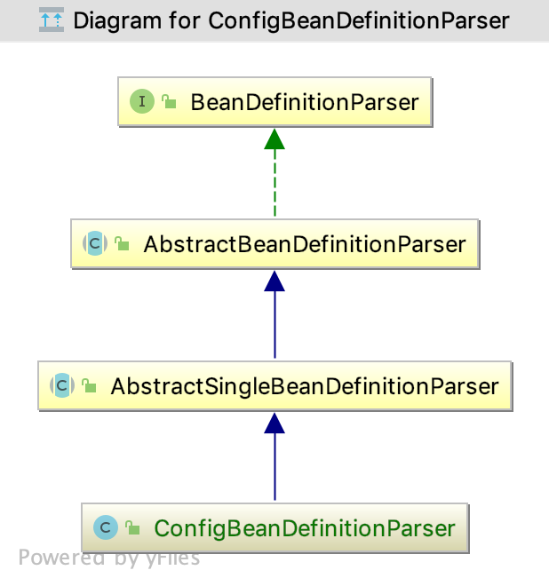
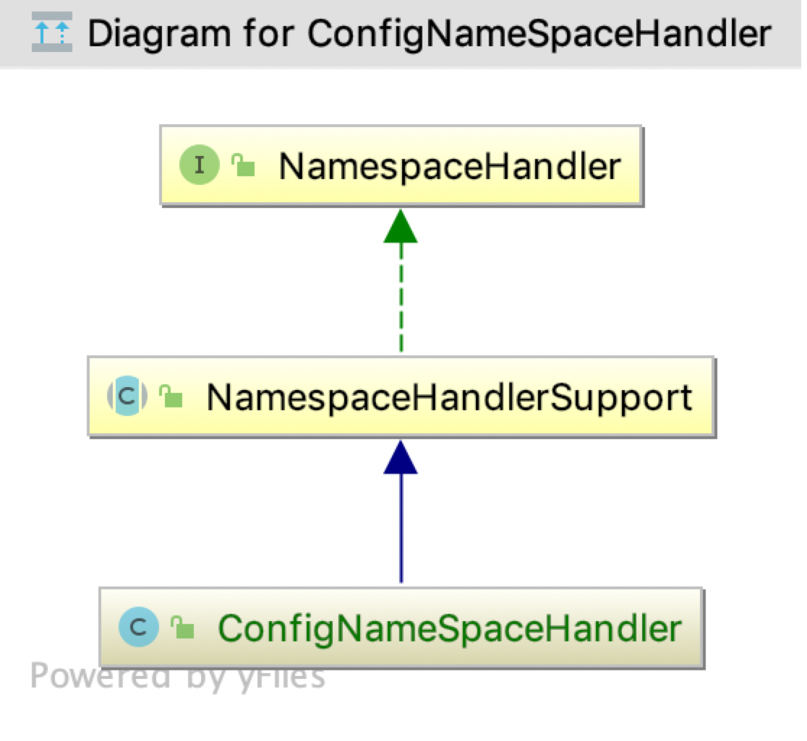
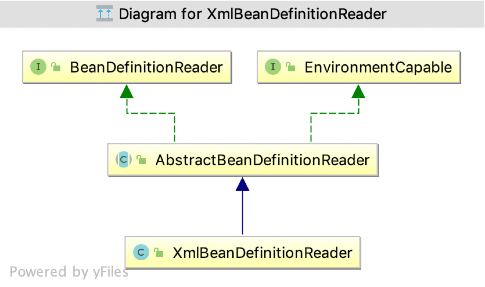
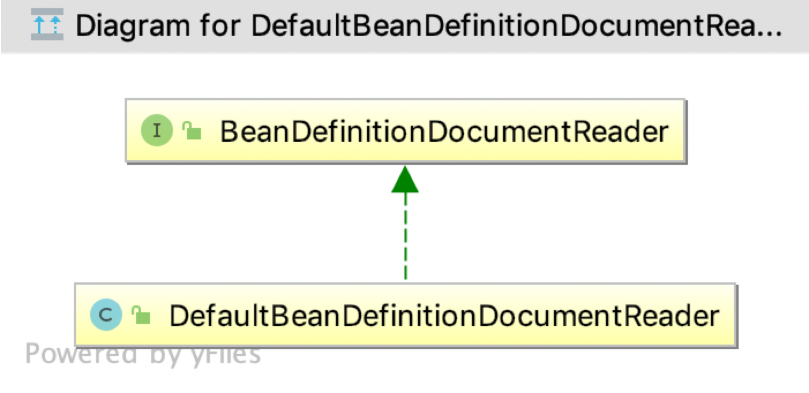

#### spring之自定义一个标签

本文将手把手教你自定义一个标签；Spring的applicationContext.xml配置文件中对标签的定义以及使用是有一定要求的，作为一个开发的框架它也支持们自行定义一些标签。

##### 创建解析目标Bean

首先，我们需要创建一个解析目标Bean，例如：Config

```
public class Config {

    private String id;
    private String name;
    private String url;

    public String getId() {
        return id;
    }

    public void setId(String id) {
        this.id = id;
    }

    public String getName() {
        return name;
    }

    public void setName(String name) {
        this.name = name;
    }

    public String getUrl() {
        return url;
    }

    public void setUrl(String url) {
        this.url = url;
    }
}
```

##### 创建元素解析器

其次，我们我们需要创建一个元素解析器，用于解析配置文件中的元素；我们可以通过继承AbstractSingleBeanDefinitionParser，来简化我们的工作

```
public class ConfigBeanDefinitionParser extends AbstractSingleBeanDefinitionParser {

    /** 获取解析的Bean类型 */
    @Override
    protected Class<?> getBeanClass(Element element) {
        return Config.class;
    }

    /** 解析过程 */
    @Override
    protected void doParse(Element element, BeanDefinitionBuilder builder) {
        String id = element.getAttribute("id");
        String name = element.getAttribute("name");
        String url = element.getAttribute("url");
        if (StringUtils.hasText(id)) {
            builder.addPropertyValue("id", id);
        }
        if (StringUtils.hasText(name)) {
            builder.addPropertyValue("name", name);
        }
        if (StringUtils.hasText(name)) {
            builder.addPropertyValue("name", name);
        }
        if (StringUtils.hasText(url)) {
            builder.addPropertyValue("url", url);
        }
    }
}
```

##### 创建命名空间处理类ConfigNameSpaceHandler

创建命名空间处理类，这个类的主要职责是注册并调用调用ConfigBeanDefinitionParser，完成解析的过程。

```
public class ConfigNameSpaceHandler extends NamespaceHandlerSupport {

    /** 注册Bean解析器 */
    @Override
    public void init() {
        registerBeanDefinitionParser("config", new ConfigBeanDefinitionParser());
    }
}
```

##### 创建xsd文件，用于校验标签的有效性以及合法性

我们创建一个config.xsd文件，定义元素信息
```
<?xml version="1.0" encoding="UTF-8" standalone="no"?>

<xsd:schema xmlns="http://www.sunce.xin/schema/config"
            xmlns:xsd="http://www.w3.org/2001/XMLSchema"
            targetNamespace="http://www.sunce.xin/schema/config"
            elementFormDefault="qualified"
            attributeFormDefault="unqualified">

    <xsd:element name="config">
        <xsd:complexType>
            <!-- name 定于成员变量名称，type 定义成员变量蕾西 -->
            <xsd:attribute name="id" type="xsd:string"/>
            <xsd:attribute name="name" type="xsd:string"/>
            <xsd:attribute name="url" type="xsd:string"/>
        </xsd:complexType>
    </xsd:element>
    
</xsd:schema>

```
targetNamespace 定义目标命名空间

##### 创建spring.handlers文件

在META-INF下创建spring.handlers文件，用于配置解析命名空间的handler，也就是我们上面辨析的ConfigNameSpaceHolder

```
http\://www.sunce.xin/schema/config=xin.sunce.spring.namespace.ConfigNameSpaceHandler
```

##### 创建spring.schemas文件

在META-INF创建spring.schemas，用于指定本地xsd文件的地址，保证即使网络不通的情况下，也可以完成xsd文件的获取

```
http\://www.sunce.xin/schema/config.xsd=/META-INF/config.xsd
```

##### 使用自定义的标签注入Bean

我们在applicationContext.xml文件中使用自己定义的标签

```
<beans xmlns="http://www.springframework.org/schema/beans"
       xmlns:xsi="http://www.w3.org/2001/XMLSchema-instance"
       xmlns:cf="http://www.sunce.xin/schema/config"
       xmlns:context="http://www.springframework.org/schema/context"
       xsi:schemaLocation="http://www.springframework.org/schema/beans
        http://www.springframework.org/schema/beans/spring-beans-4.3.xsd
        http://www.springframework.org/schema/context
       http://www.springframework.org/schema/context/spring-context-4.3.xsd
       http://www.sunce.xin/schema/config
       http://www.sunce.xin/schema/config.xsd">
    
    <context:component-scan base-package="xin.sunce.spring"/>

    <cf:config id="user" url="http://www.sunce.xin" name="ce.sun"/>

</beans>
```
我们先引入自定义的标签
        
        xmlns:cf="http://www.sunce.xin/schema/config"
        
并配置schemaLocation 

       http://www.sunce.xin/schema/config
       http://www.sunce.xin/schema/config.xsd

我们配置spring.schemas，会优先从本地获取，使用config

      <cf:config id="user" url="http://www.sunce.xin" name="ce.sun"/>
      
##### 验证是否注入成功

```
public class ApplicationContextTest {

private ApplicationContext applicationContext;

@Before
public void initApplicationContext() {
    applicationContext = new ClassPathXmlApplicationContext("applicationContext.xml");
}

@Test
public void testNameSpace() {
    Config config = (Config) applicationContext.getBean(Config.class);
    System.out.println(config.toString());
}

}
```

##### 源码浅析

验证结束后，我们一起来探究是如何实现的；我们先看看解析器的继承关系，如下图所示：



接口BeanDefinitionParser的定义如下：

```
public interface BeanDefinitionParser {
    @Nullable
    BeanDefinition parse(Element var1, ParserContext var2);
}

```

AbstractBeanDefinitionParser实现了parse方法，并调用声明了有抽象方法parseInternal，交由子类实现

```
public abstract class AbstractBeanDefinitionParser implements BeanDefinitionParser {
    

    @Nullable
    public final BeanDefinition parse(Element element, ParserContext parserContext) {
        AbstractBeanDefinition definition = this.parseInternal(element, parserContext);
        ......
        
   }
   
    @Nullable
    protected abstract AbstractBeanDefinition parseInternal(Element var1, ParserContext var2);


```

AbstractSingleBeanDefinitionParser同样的实现了parseInternal方法，声明了doParse交由子类实现；

```
public abstract class AbstractSingleBeanDefinitionParser extends AbstractBeanDefinitionParser {

    protected final AbstractBeanDefinition parseInternal(Element element, ParserContext parserContext) {
        BeanDefinitionBuilder builder = BeanDefinitionBuilder.genericBeanDefinition();
        String parentName = this.getParentName(element);
        if (parentName != null) {
            builder.getRawBeanDefinition().setParentName(parentName);
        }
        
        //获取目标Bean
        Class<?> beanClass = this.getBeanClass(element);
        if (beanClass != null) {
            builder.getRawBeanDefinition().setBeanClass(beanClass);
        } else {
            String beanClassName = this.getBeanClassName(element);
            if (beanClassName != null) {
                builder.getRawBeanDefinition().setBeanClassName(beanClassName);
            }
        }

        builder.getRawBeanDefinition().setSource(parserContext.extractSource(element));
        BeanDefinition containingBd = parserContext.getContainingBeanDefinition();
        if (containingBd != null) {
            builder.setScope(containingBd.getScope());
        }

        if (parserContext.isDefaultLazyInit()) {
            builder.setLazyInit(true);
        }
        
        //处理解析逻辑
        this.doParse(element, parserContext, builder);
        return builder.getBeanDefinition();
    }
    
    protected void doParse(Element element, ParserContext parserContext, BeanDefinitionBuilder builder) {
        this.doParse(element, builder);
    }

    protected void doParse(Element element, BeanDefinitionBuilder builder) {
    }
}
```

我们的解析逻辑
```
@Override
protected void doParse(Element element, BeanDefinitionBuilder builder) {
    String id = element.getAttribute("id");
    String name = element.getAttribute("name");
    String url = element.getAttribute("url");
    if (StringUtils.hasText(id)) {
        builder.addPropertyValue("id", id);
    }
    if (StringUtils.hasText(name)) {
        builder.addPropertyValue("name", name);
    }
    if (StringUtils.hasText(name)) {
        builder.addPropertyValue("name", name);
    }
    if (StringUtils.hasText(url)) {
        builder.addPropertyValue("url", url);
    }
}
```

至此解析过程完成；那么Parser的加载是如何加载的呢？Parser又是何时被调用的呢？

我们先了解ConfigNameSpaceHandler的继承关系


了解NamespaceHandler的接口定义
```
public interface NamespaceHandler {
    
    //初始化
    void init();
    
    //解析
    @Nullable
    BeanDefinition parse(Element var1, ParserContext var2);
    
    //装饰
    @Nullable
    BeanDefinitionHolder decorate(Node var1, BeanDefinitionHolder var2, ParserContext var3);
}

```

NamespaceHandlerSupport对以上接口进行了实现，并开发给子类相关注册
```
public abstract class NamespaceHandlerSupport implements NamespaceHandler {
    private final Map<String, BeanDefinitionParser> parsers = new HashMap();
    private final Map<String, BeanDefinitionDecorator> decorators = new HashMap();
    private final Map<String, BeanDefinitionDecorator> attributeDecorators = new HashMap();

    public NamespaceHandlerSupport() {
    }

    @Nullable
    public BeanDefinition parse(Element element, ParserContext parserContext) {
        //找到对应的parser，并调用parse方法
        BeanDefinitionParser parser = this.findParserForElement(element, parserContext);
        return parser != null ? parser.parse(element, parserContext) : null;
    }

    
    @Nullable
    public BeanDefinitionHolder decorate(Node node, BeanDefinitionHolder definition, ParserContext parserContext) {
        //找到对应的装饰器，并调用装饰方法
        BeanDefinitionDecorator decorator = this.findDecoratorForNode(node, parserContext);
        return decorator != null ? decorator.decorate(node, definition, parserContext) : null;
    }
    
    //注册parser
    protected final void registerBeanDefinitionParser(String elementName, BeanDefinitionParser parser) {
        this.parsers.put(elementName, parser);
    }
    
    //注册装饰器
    protected final void registerBeanDefinitionDecorator(String elementName, BeanDefinitionDecorator dec) {
        this.decorators.put(elementName, dec);
    }
    
    protected final void registerBeanDefinitionDecoratorForAttribute(String attrName, BeanDefinitionDecorator dec) {
        this.attributeDecorators.put(attrName, dec);
    }
}    
```

parsers，decorators又是何时被赋值的呢？

```
public class ConfigNameSpaceHandler extends NamespaceHandlerSupport {
    
    /** 子类实现init方法，并完成注册*/
    @Override
    public void init() {
        registerBeanDefinitionParser("config", new ConfigBeanDefinitionParser());
    }
}
```

接下来是使用阶段的分析，我们先看看BeanDefinition的处理逻辑



BeanDefinitionReader 定义了loadBeanDefinitions的方法
```
public interface BeanDefinitionReader {
    BeanDefinitionRegistry getRegistry();

    @Nullable
    ResourceLoader getResourceLoader();

    @Nullable
    ClassLoader getBeanClassLoader();

    BeanNameGenerator getBeanNameGenerator();

    int loadBeanDefinitions(Resource var1) throws BeanDefinitionStoreException;

    int loadBeanDefinitions(Resource... var1) throws BeanDefinitionStoreException;

    int loadBeanDefinitions(String var1) throws BeanDefinitionStoreException;

    int loadBeanDefinitions(String... var1) throws BeanDefinitionStoreException;
}
```
XmlBeanDefinitionReader 对loadBeanDefinitions 进行了实现

```
public class XmlBeanDefinitionReader{

..... 省略代码 ....
public int loadBeanDefinitions(EncodedResource encodedResource) throws BeanDefinitionStoreException {
    
    ..... 省略代码 ....
    this.doLoadBeanDefinitions(inputSource, encodedResource.getResource());
    ..... 省略代码 ....
    
}

protected int doLoadBeanDefinitions(InputSource inputSource, Resource resource) throws BeanDefinitionStoreException {
    ..... 省略代码 ....
    //获取文件
    Document doc = this.doLoadDocument(inputSource, resource);
    //根据文件完成注册
    int count = this.registerBeanDefinitions(doc, resource);
    ..... 省略代码 ....
}

//注册Bean定义
public int registerBeanDefinitions(Document doc, Resource resource) throws BeanDefinitionStoreException {
    
    //获取Bean定义读取器
    BeanDefinitionDocumentReader documentReader = this.createBeanDefinitionDocumentReader();
    int countBefore = this.getRegistry().getBeanDefinitionCount();
    //注册Bean定义
    documentReader.registerBeanDefinitions(doc, this.createReaderContext(resource));
    return this.getRegistry().getBeanDefinitionCount() - countBefore;
}

// 此处的BeanDefinitionDocumentReader为DefaultBeanDefinitionDocumentReader
protected BeanDefinitionDocumentReader createBeanDefinitionDocumentReader() {
        return (BeanDefinitionDocumentReader)BeanUtils.instantiateClass(this.documentReaderClass);
}
    

}
```
DefaultBeanDefinitionDocumentReader 的继承关系如下：


```
public class DefaultBeanDefinitionDocumentReader implements BeanDefinitionDocumentReader {

 public void registerBeanDefinitions(Document doc, XmlReaderContext readerContext) {
    this.readerContext = readerContext;
    this.doRegisterBeanDefinitions(doc.getDocumentElement());
}

protected void doRegisterBeanDefinitions(Element root) {
        BeanDefinitionParserDelegate parent = this.delegate;
        ........
        this.preProcessXml(root);
        this.parseBeanDefinitions(root, this.delegate);
        this.postProcessXml(root);
        this.delegate = parent;
    }
}    


protected void parseBeanDefinitions(Element root, BeanDefinitionParserDelegate delegate) {
        if (delegate.isDefaultNamespace(root)) {
            NodeList nl = root.getChildNodes();

            for(int i = 0; i < nl.getLength(); ++i) {
                Node node = nl.item(i);
                if (node instanceof Element) {
                    Element ele = (Element)node;
                    if (delegate.isDefaultNamespace(ele)) {
                        //解析默认的命名空间 
                        this.parseDefaultElement(ele, delegate);
                    } else {
                        //解析自定义的命名空间
                        delegate.parseCustomElement(ele);
                    }
                }
            }
        } else {
            //解析自定义的命名空间
            delegate.parseCustomElement(root);
        }

    }
```
delegate解析自定义元素如下：

```
@Nullable
public BeanDefinition parseCustomElement(Element ele, @Nullable BeanDefinition containingBd) {
    String namespaceUri = this.getNamespaceURI(ele);
    if (namespaceUri == null) {
        return null;
    } else {
        //根据namespaceUri 获取NamespaceHandler，相当于从spring.handlers获取
        NamespaceHandler handler = this.readerContext.getNamespaceHandlerResolver().resolve(namespaceUri);
        if (handler == null) {
            this.error("Unable to locate Spring NamespaceHandler for XML schema namespace [" + namespaceUri + "]", ele);
            return null;
        } else {
            //完成解析       
            return handler.parse(ele, new ParserContext(this.readerContext, this, containingBd));
        }
    }
}
```

以上便是自定义标签，以及如何生效利用的全部过程


