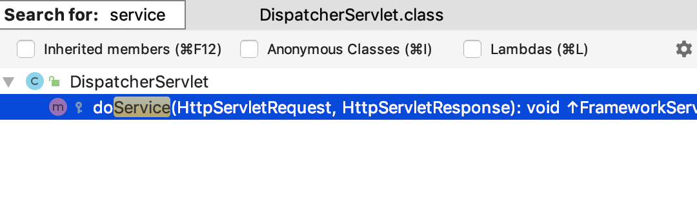

#### MVC简介

       我们开门见山，首先要明确MVC是一种设计思想，它的目的是明确各个模块之间自己的职责，进而达成解耦的效果，
    M代表着Model层，顾名思义这一层包含着各种各样的模型，例如数据模型，业务模型等等，我们通常开发的Service
    属于这一层；V代表是View层，这一层是视图层，即渲染展现给用户的各种页面，View；而C则代表着Controller层，
    这一层是Model跟View层之间的桥梁，它将请求转发给对应的Model，并将Model层处理的结果返回给View层。
        
        
#### MVC实现

       只要一提到MVC，人们往往就会脱口而出SpringMVC；但是MVC跟SpringMVC还是有区别的，MVC是一种设计思想；
    而SpringMVC是一个被我们熟知且广泛使用的一个实现MVC的框架；还有一个常用的MVC框架你可能也耳熟能详Struts；
    Struts较SpringMVC出现较早，起初有较大的市场份额，但随着SpringMVC的横空出世以及时间的推移，Struts的份
    额逐年减少，SpringMVC的份额则遥遥领先；本文将着重针对SpringMVC进行介绍。
      
#### SpringMVC

       了解的MVC的前世今生，我们开始了解SpringMVC，在SpringMVC中有一个核心便是DispatcherServlet，如果
    一个人的简历是写着熟悉SpringMVC，而对于DispatcherServlet一问三不知，那么这个人显然是不合格的。以下是
    DispatcherServlet的类图。
       


        了解清楚类图以后，我这里提出一些问题大家思考一下，你了解Servlet的生命周期么？Servlet跟
    DispatcherServlet有什么关系？又有什么区别？
        

首先，我们来了解Servlet的生命周期，先看看Servlet的代码:
```
public interface Servlet {

    void init(ServletConfig var1) throws ServletException;
    
    .....
    
    void service(ServletRequest var1, ServletResponse var2) throws ServletException, IOException;

    .....

    void destroy();
}

```

#### Servlet的生命周期

    0.首先创建Servlet实例

    1.其次调用Servlet.init()，完成初始化，在一个Servlet的生命周期中init方法只会被执行一次，无论用户执行
    多少请求，都不会再次调用init方法；

    2.业务的实际处理是Servlet.service()执行的；所以每一次请求的处理，最终都会有service方法执行处理，所以
    这个方法可以被多次调用；

    3.Servlet对象的销毁时调用Servlet.destroy()方法，同样的这个方法也只会被调用一次。而HttpServlet是
    Servlet的一个实现，在调用service方法时，会根据具体的请求类型，调用具体的protected方法，doGet，
    doPost，doHead等。
    
    
#### 开端

       回顾DispatcherServlet的类图，我们知道HttpServlet是其超类（父类），所以它的生命周期跟Servlet一致，
    那么我们一起看看DispatcherServlet的核心service方法。
       
如下：

        
        我们在DispatcherServlet并没有找到service方法，而是找到一个doService方法，我们在DispatcherServlet
    的父类FrameworkServlet中找到了service方法的实现，代码片段如下：
   
```
protected void service(HttpServletRequest request, HttpServletResponse response) throws ServletException, IOException {
        HttpMethod httpMethod = HttpMethod.resolve(request.getMethod());
        if (HttpMethod.PATCH != httpMethod && httpMethod != null) {
            super.service(request, response);
        } else {
            this.processRequest(request, response);
        }

    }
    
protected final void doGet(HttpServletRequest request, HttpServletResponse response) throws ServletException, IOException {
    this.processRequest(request, response);
}

protected final void doPost(HttpServletRequest request, HttpServletResponse response) throws ServletException, IOException {
    this.processRequest(request, response);
 }
    
..... 省略部分代码
protected final void processRequest(HttpServletRequest request, HttpServletResponse response) throws ServletException, IOException {
    .....
    this.doService(request, response);
    .....
}

..... 省略部分代码

protected abstract void doService(HttpServletRequest var1, HttpServletResponse var2) throws Exception;

    
```
   
        在FrameworkServlet的service方法中，在HttpMethod不等于PATCH且不等于空的情况下调用了父类的
     Service方法，而父类的Service方法又会根据请求类型调用具体的doGet或者doPost等方法，FrameworkServlet
     的doGet等方法会将请求送到processRequest方法中，所以FrameworkServlet及其子类请求都在processRequest
     处理，该方法在处理时会调用冲向方法doService，所以DispatcherServlet处理的核心便是我们之前看到的
     doService方法；
     
        细心的你，也许会指出service方法的请求参数变成HttpServletRequest，HttpServletResponse而不是
     ServletRequest，ServletResponse；原因是HttpServlet在实现service方式时，对service方法进行了重写，
     代码细节如下：
        
        
```
public void service(ServletRequest req, ServletResponse res) throws ServletException, IOException {
        HttpServletRequest request;
        HttpServletResponse response;
        try {
            request = (HttpServletRequest)req;
            response = (HttpServletResponse)res;
        } catch (ClassCastException var6) {
            throw new ServletException("non-HTTP request or response");
        }

        this.service(request, response);
    }
```
**重写后的方法的参数，便成为了HttpServletXX，而FrameworkServlet又继承自HttpServlet的子类HttpServletBean，
所以直到DispatcherServlet这一子类，以下是一张时序图帮你梳理这个过程**


#### 揭开doService的神秘面纱
```
private List<HandlerMapping> handlerMappings;
private List<HandlerAdapter> handlerAdapters;
private List<HandlerExceptionResolver> handlerExceptionResolvers;
private List<ViewResolver> viewResolvers;

/**
* Spring容器初始化Bean时会调用
*/
protected void onRefresh(ApplicationContext context) {
    this.initStrategies(context);
}

/***
* 初始化handlerMappings，handlerAdapters，viewResolvers等
*/
protected void initStrategies(ApplicationContext context) {
    this.initMultipartResolver(context);
    this.initLocaleResolver(context);
    this.initThemeResolver(context);
    this.initHandlerMappings(context);
    this.initHandlerAdapters(context);
    this.initHandlerExceptionResolvers(context);
    this.initRequestToViewNameTranslator(context);
    this.initViewResolvers(context);
    this.initFlashMapManager(context);
}

protected void doService(HttpServletRequest request, HttpServletResponse response) throws Exception {
    .....
    this.doDispatch(request, response);
    .....
}

.....

protected void doDispatch(HttpServletRequest request, HttpServletResponse response) throws Exception {
    HandlerExecutionChain mappedHandler = null;
    ...
    ModelAndView mv = null;
    ...
    mappedHandler = this.getHandler(processedRequest);
    ...
    HandlerAdapter ha=this.getHandlerAdapter(mappedHandler.getHandler());
    ...
    mv = ha.handle(processedRequest,response,mappedHandler.getHandler());
    ...
    this.processDispatchResult(processedRequest, response, 
    mappedHandler, mv, (Exception)dispatchException);
}

```
**doService方法调用doDispatch方法，在doDispatch方法中获取Handler，在根据Handler获取对应的HandlerAdapter实例ha，然后ha调用handle方法处理请求，并返回ModelAndView实例mv,随后调用processDispatchResult处理dispatch结果。**

#### getHandler()详解
图initHandlerMapping


图getHandler


**图initHandlerMapping**给我们展示了List<HandlerMapping> handlerMappings的初始化过程，注意是懒加载；ApplicationContext 获取全部的HandlerMapping类，并且依照Order书序排序

**图getHandler**说明，会根据请求HttpServletRequest迭代循环获取HandlerExecutionChain，直到获取的Handler不为空，Http请求最终会获取到  **RequestMappingHandlerMapping** ；可以通过debug了解该过程

#### getHandlerAdapter()详解

**initHandlerAdapters**的过程与初始化**initHandlerMapping**类似

而获取adapter的过程与获取handler的过程又高度类似，只不过在迭代的过程中会判断当前adapter是否支持此handler，调用HandlerAdapter.supports(Object var1)方法；支持RequestMappingHandlerMapping的adapter是**RequestMappingHandlerAdapter**

**获取过程**：根据HandlerExecutionChain 获取 Handler对象，然后根据Handler获取对应的HandlerAdapter

#### handle()详解

先了解一下RequestMappingHandlerAdapter继承实现关系


用一下时序图梳理handle方法的处理过程

RequestMappingHandlerAdapter 以下简称 RMH
AbstractHandlerMethodAdapter 以下简称 AHMD


#### processDispatchResult()详解

这个环节会对handle方法返回的ModelAndView进行处理


```
protected void render(ModelAndView mv, HttpServletRequest request, HttpServletResponse response) throws Exception {
    View view;
    .....
    view = this.resolveViewName(mv.getViewName(), mv.getModelInternal(), locale, request);
    .....        
    view.render(mv.getModelInternal(), request, response);
        
 }
 
 protected View resolveViewName(String viewName, Map<String, Object> model, Locale locale, HttpServletRequest request) throws Exception {
    Iterator var5 = this.viewResolvers.iterator();

    View view;
    do {
        if (!var5.hasNext()) {
            return null;
        }

        ViewResolver viewResolver = (ViewResolver)var5.next();
        view = viewResolver.resolveViewName(viewName, locale);
    } while(view == null);

    return view;
 }
    
```

如此以上便是MVC的大致流程，梳理一下核心点：

1.用户发送请求

2.dispatcherServlet 调用 doDispatch方法

3.从HandlerMappings中获取相应的HandlerExecutionChain

4.从HandlerMappingAdapters中获取对应的adapter

5.adapter调用handle方法返回ModelAndView

6.从viewResolvers获取viewResolver解析ModelAndView为View

7.dispatcherServlet 给用户响应

8.用户收到响应


